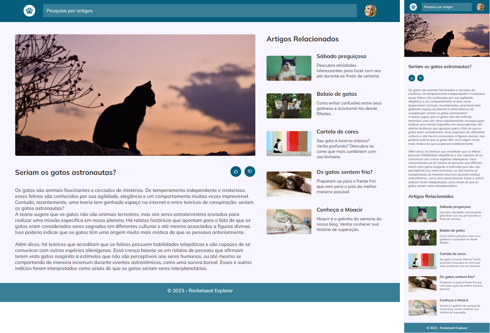

<h1 align="center">Blog de Gatos</h1>

  

## 🚀 Tecnologias

Esse projeto foi desenvolvido com as seguintes tecnologias:
- HTML e CSS
- Git e Github
- Figma

## 💻 Projeto
Nesse Projeto usamos ferramentas como:

- Mobile First
- Grid
- grid-template-areas
- Unidade de medida flexível
- Variáveis e cores HSL
- Transições
- Animações 

## 🔗 Online
- [Acesse o projeto finalizado, online](https://jonatanfiuza.github.io/blogdegatos)
---
Feito com ♥ por Jonatan Fiuza by Rocketseat 